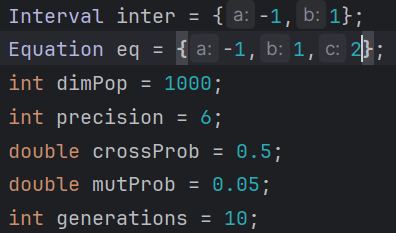

## What is a [Genetic Algorithm](https://www.mathworks.com/help/gads/what-is-the-genetic-algorithm.html) ?

### [Homework](Task/Algoritmi Genetici.pdf) and Materials proposed by [Stefan Popescu](stefan.popescu@unibuc.ro)
## Input:
- coefficients of a quadratic formula
```
        ax²+bx+c  , a < 0,  a,b,c ∈ Z
```
- a closed interval
```
        [left, right] , left,right ∈ Z
```
- the dimension of the population
- a precision 
- the crossover probability
- the mutation probability
- number of generations  


## Output:
### For the first generation
- Initial individuals
    1. <b><i>Bi</i></b>, binary representation
    2. <b><i>Xi</i></b>, corresponding real value
    3. <b><i>f(Xi)</i></b>, value after applying the function
- Selection probability for each individual
```
      f (Xi)
pi = ----------
      ∑jf (Xj)
```
- Cumulative probabilities that give the selection intervals
```
q0 = 0
    i
qi =∑ pj = p1 + ⋯ + pi
   j=1
```
- Selection process
  - the elitist (individual with best <b><i>fitness</b></i>) skips this step

  - generating a random number <b><i>u∈[0,1)</i></b> 
  - determining to the interval 
  <b><i>[qi ,qi+1)</i></b> corresponding to that,
  - chromosome <b><i>i+1</i></b> is selected  
  - with [binary search](https://www.geeksforgeeks.org/binary-search/)
- Crossover process
  - generating a random number <b><i>u∈[0,1)</i></b>
  - if <b><i>u < P(crossover)</i></b>
  - find another chromosome with that property
  - generate a random cross point
  - swap their tails at that point

- Mutation process
    - iterate each individual's binary representation
    - for each bit of the number
    - generating a random number <b><i>u∈[0,1)</i></b>
    - if <b><i>u < P(mutation)</i></b>
    - bitflip
- The resulting population

```
Max Fitness = max f(Xi)
               i
                 1
Mean Fitness =  --- ∑ f(Xi)
                 n  i
```
> [!NOTE]  
> The <b><i>cout stream</b></i> has been redirected to the output file
### For next generations
- Only
```
Max Fitness = max f(Xi)
               i
                 1
Mean Fitness =  --- ∑ f(Xi)
                 n  i
```
> [!NOTE]  
> The methods are all the same except the <b><i>cout stream</b></i> has been redirected to a <b><i>null buffer</b></i> 
> so it doesn't get printed.
>  
> Also, for the <b><i>Max Fitness</b></i> and <b><i>Mean Fitness</b></i> the <b><i>fprintf</b></i> method has been used
> for the output to be displayed regardless of the step we're in


## gnuplot
Used [gnuplot](http://www.gnuplot.info/) for plotting the generated points at the final step

    
